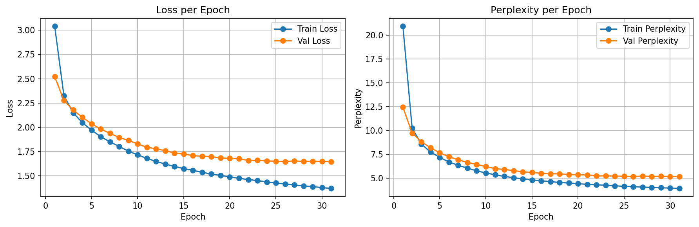
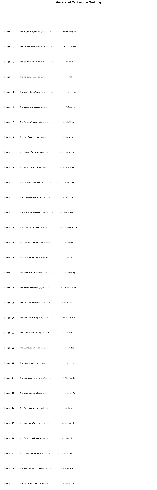

# 4. RNN Shakespeare — Character-Level Text Generation

## Why RNNs?

CNN projects handled **spatial patterns** in images — convolutions slide over 2D grids to detect edges, shapes, and objects. But what about **sequential data** where order matters?

Shuffle the pixels of a cat photo → still recognizable. Shuffle the characters of "to be or not to be" → meaningless.

An RNN reads data **one step at a time**, carrying a **hidden state** that acts as memory of everything it's seen so far. This project builds a character-level vanilla RNN that learns to write Shakespeare — one character at a time — from scratch.

---

## Architecture

```
Input (N, 100)           — character indices (integers 0-64)
  → One-hot (N, 100, 65) — each char becomes a 65-dim vector
  → nn.RNN (N, 100, 512) — hidden state updated at each timestep
  → nn.Linear (N, 100, 65) — logits for next character prediction
```

| Component | Spec |
|-----------|------|
| RNN | `nn.RNN(65, 512, num_layers=1, batch_first=True)` |
| Output | `nn.Linear(512, 65)` |
| Total params | 329,793 |
| Gradient clipping | `max_norm=5.0` (prevents exploding gradients in BPTT) |

---

## Dataset

**Tiny Shakespeare** (~1.1MB, ~40,000 lines of Shakespeare plays)
- 65 unique characters (letters, punctuation, whitespace)
- Split: 80% train / 10% val / 10% test (contiguous, not shuffled)
- 8,923 training sequences of length 100

---

## Training Results

| Metric | Value |
|--------|-------|
| Best Val Loss | 1.6466 (epoch 26) |
| Test Loss | 1.8455 |
| Test Perplexity | 6.33 |
| Early Stopping | Epoch 31 (patience 5) |

Perplexity dropped from ~65 (random guessing) → 6.33, meaning the model effectively narrows down the next character to ~6 candidates instead of 65.

### Loss & Perplexity Curves



### Generated Text Progression



---

## Temperature Comparison

Temperature controls randomness in text generation: `logits / T` before softmax.

**Temperature = 0.5 (conservative)**
```
ROMEO:
I do not stand of such a prince.

KING HENRY VI:
What, hath some confused buthing the consinus.
```
Coherent structure, character names, but somewhat repetitive.

**Temperature = 1.0 (balanced)**
```
ROMEO:
What shall I say to thee, and the people shall be the seast
That the bear and the common sease of the world...
```
More varied vocabulary, occasional spelling errors.

**Temperature = 1.5 (creative)**
```
ROMEO:
I'll do yourknmy to clowe bift welt- Cintlize I;
BnR, holy quontanf; yevour gigdal newfosher' lett.
```
Creative but mostly gibberish — probabilities too flat.

---

## What the Vanilla RNN Learned

**Learned well:**
- English spelling for common short words (the, and, shall, not)
- Shakespeare's formatting (character names in CAPS, colons, line breaks)
- Basic sentence structure and punctuation

**Struggled with:**
- Long words — spelling breaks down after 5-6 characters
- Long-range coherence — sentences start well but drift
- Consistent character dialogue — can't maintain a character's "voice"

---

## What's Next: LSTM

These limitations stem from the **vanishing gradient problem**. During BPTT, gradients get multiplied by W_hh at each timestep. Over 100 steps, they shrink toward zero — the RNN "forgets" what it read early in the sequence.

**LSTM** (Long Short-Term Memory) solves this with a **gating mechanism** that controls what to remember and what to forget, enabling learning over much longer sequences. That's the next project.

---

## Lessons Learned

**One-hot encoding is intentionally naive.** Each character becomes a sparse 65-dim vector with no notion of similarity. This forces the RNN to learn all character relationships from scratch — good for understanding, but inefficient. The next step (LSTM project) introduces `nn.Embedding`, which learns dense representations where similar characters naturally cluster.

**Gradient clipping isn't optional for vanilla RNNs.** During BPTT, gradients are multiplied by W_hh at each of the 100 timesteps. Without `clip_grad_norm_`, training diverges within a few epochs — loss explodes to infinity. This is the exploding gradient problem in practice, not just theory.

**Temperature is just division before softmax.** `logits / T` before softmax — that's the entire trick. Low T sharpens the distribution (safe, repetitive), high T flattens it (creative, chaotic). At T=0.5 the model produces coherent Shakespeare; at T=1.5 it's mostly gibberish. This single parameter controls the diversity-quality tradeoff in all language generation.

**Custom Datasets are simpler than expected.** Coming from `torchvision.datasets` which handles everything, building `ShakespeareDataset` with just `__len__` and `__getitem__` was straightforward. The key insight: the DataLoader doesn't care what's inside — it just needs to know how many samples exist and how to fetch one by index.

**Perplexity makes loss interpretable.** A loss of 1.85 is hard to reason about. But perplexity of 6.33 means "the model is choosing between ~6 characters" — immediately intuitive, and directly comparable across different models and datasets.

**The RNN's failures are as instructive as its successes.** It learns spelling, formatting, and short phrases well. But longer words break down and sentences lose coherence — because the hidden state is a single vector trying to compress all past context. This limitation isn't a bug to fix with more training; it's a fundamental architectural constraint that LSTM addresses with explicit memory gates.

---

## How to Run

```bash
# Train from scratch
cd scripts && python3 train.py

# Resume from checkpoint
python3 train.py --resume-from ../results/best_model.pth
```

Results are saved to `results/`:
- `best_model.pth` — model weights
- `loss_perplexity_curves.png` — training curves
- `training_samples.png` — text generation progression
- `sample_outputs.txt` — generated text at 3 temperatures
