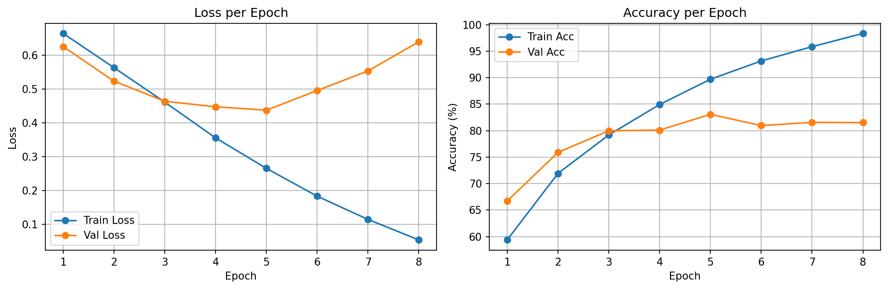
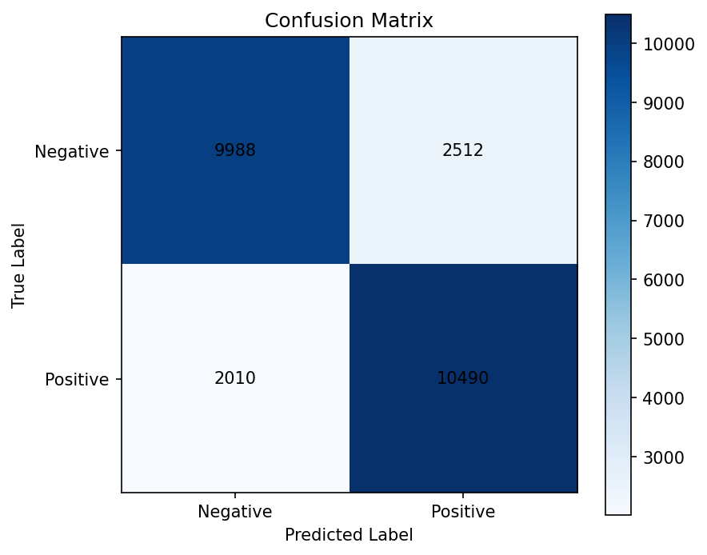

# 5. LSTM Sentiment Analysis — IMDB Review Classification

Binary sentiment classification on **IMDB movie reviews** using a **single-layer LSTM** with learned word embeddings.

This project is the next step after the vanilla RNN Shakespeare project: instead of predicting the next character, the model now reads an entire review and predicts a single label: **positive** or **negative**.

---

## Why LSTM?

### The limitation from the previous project

In the Shakespeare project, the vanilla RNN could learn short-range patterns such as spelling, punctuation, and formatting, but it struggled to preserve meaning across longer sequences. A single hidden state was doing all the work, and gradients faded as sequence length grew.

Movie reviews make this limitation even more obvious:

- sentiment is often expressed over many words, not a single token
- phrases like `not good`, `surprisingly decent`, or `slow at first but worth it` depend on order and context
- the model needs to compress an entire review into one useful summary vector

### What LSTM changes

LSTM adds a **cell state** and **gates** that control what to remember, update, or forget. That gives it a much better chance of keeping important context alive across long sequences.

This project also introduces **word embeddings**, so words are no longer represented as huge sparse one-hot vectors. Instead, each token gets a learned dense vector that the model can organize semantically during training.

---

## Dataset

**Source:** IMDB via Hugging Face `datasets`

| Split | Size | Notes |
|------|------|------|
| Train | 20,000 | from the original 25k training set |
| Validation | 5,000 | stratified split, `seed=42` |
| Test | 25,000 | untouched until final evaluation |

### Preprocessing

- Tokenization: simple whitespace split
- Vocabulary: top **25,000** words from the training split only
- Special tokens:
  - `<pad> = 0`
  - `<unk> = 1`
- Max length: **256** tokens
- Labels:
  - `0 = negative`
  - `1 = positive`

This is intentionally simple and educational. The point of v1 is to understand sequence modeling, padding, embeddings, and LSTM training before moving on to pretrained embeddings.

---

## Architecture

```text
Input (N, seq_len_in_batch)              # word indices
  -> nn.Embedding(vocab_size, 100)       # (N, seq_len_in_batch, 100)
  -> pack_padded_sequence(...)           # remove padded tail for LSTM
  -> nn.LSTM(100, 256, batch_first=True) # final hidden state: (1, N, 256)
  -> h_n[-1]                             # (N, 256)
  -> nn.Linear(256, 1)                   # (N, 1) binary logit
```

| Component | Spec |
|----------|------|
| Embedding | `nn.Embedding(vocab_size, 100, padding_idx=0)` |
| LSTM | `nn.LSTM(100, 256, num_layers=1, batch_first=True)` |
| Classifier | `nn.Linear(256, 1)` |
| Loss | `BCEWithLogitsLoss` |
| Optimizer | `Adam(lr=0.001)` |
| Gradient clipping | `max_norm=1.0` |
| Early stopping | validation loss, `patience=3` |
| Max epochs | `15` |
| Total params | `2,867,049` |

---

## Important Implementation Decisions

### 1. Why output shape is `(N, 1)`

This is a **binary classification** task, not next-token prediction. Each review needs only one output logit, so the final layer is:

```python
nn.Linear(256, 1)
```

That is why training uses:

- `BCEWithLogitsLoss`
- `sigmoid(logits) > 0.5` for prediction

rather than `CrossEntropyLoss + argmax`.

### 2. Why packed sequence mattered

The first naive version simply took the final hidden state after feeding padded reviews through the LSTM. That turned out to be a serious mistake.

Short reviews were read like this:

```text
real words ... <pad> <pad> <pad> <pad> ...
```

So the model summary was being taken **after many meaningless padding steps**, not right after the final real word. That hurt representation quality badly.

Two fixes were tried:

| Step | Idea | Outcome |
|------|------|---------|
| Naive padded LSTM | use final hidden state after full padded sequence | ~51% test acc |
| Packed sequence | make the LSTM ignore padding timesteps | ~81% test acc |
| Dynamic batch trimming | trim each batch to its own longest review before packing | kept accuracy stable, reduced wasted computation |

This became one of the main lessons of the project:

> In sequence models, padding is not just a data-formatting detail. It can directly affect the quality of the final representation if handled incorrectly.

### 3. Why dynamic padding was added

All reviews were still stored with a global maximum length of 256 for simplicity. But many batches did not need all 256 steps.

So a custom `collate_fn` trims each batch to its own maximum real length before the embedding/LSTM step. This keeps the pipeline simple while reducing wasted work.

---

## Results

### Final v1 Metrics

| Metric | Value |
|-------|-------|
| Best Val Loss | **0.4376** |
| Best Val Accuracy | **83.08%** |
| Final Test Loss | **0.4587** |
| Final Test Accuracy | **81.91%** |
| Early Stopping | epoch 8 |

For a first LSTM sentiment baseline with scratch embeddings and simple tokenization, this is a solid result.

### Training Curves



The curves show a healthy learning pattern:

- train accuracy rises steadily into the high 90s
- validation accuracy peaks around the low 80s
- after epoch 5, train performance keeps improving while validation loss worsens

That is a clear overfitting signal, and early stopping helps preserve the best checkpoint.

---

## Confusion Matrix Analysis



The final confusion matrix was:

```text
[[9988, 2512],
 [2010, 10490]]
```

This means:

- **True Negative:** 9,988
- **False Positive:** 2,512
- **False Negative:** 2,010
- **True Positive:** 10,490

### What this tells us

- The model is slightly better at catching **positive** reviews than **negative** ones.
- Positive recall is about **83.9%**
- Negative specificity is about **79.9%**

So the baseline shows a **mild bias toward positive predictions**.

That pattern also appears in the qualitative error analysis below.

---

## Wrong Prediction Analysis

See the full text report here:

- [Wrong Prediction Report](results/v1/wrong_predictions.md)

The most common error pattern was **false positives**: negative reviews predicted as positive.

### Common false positive pattern

Many negative reviews still contained local praise words such as:

- `decent`
- `enjoy`
- `pretty good`
- `quite enjoyed`

The overall review was still negative, but the model often followed those positive cues too strongly.

### Common false negative pattern

Some positive reviews discussed heavy or serious topics using words like:

- `controversial`
- `lack`
- `dying`
- `abuse`

In those cases, the model sometimes followed the negative surface vocabulary more than the overall positive judgment.

### Takeaway

The baseline LSTM is already learning useful sentiment features, but it still struggles with:

- mixed sentiment
- contrastive phrasing
- reviews where local wording and final sentiment do not align cleanly

---

## What Changed vs Project 4?

| Project 4: RNN Shakespeare | Project 5: LSTM Sentiment |
|---------------------------|---------------------------|
| character-level modeling | word-level modeling |
| next-character prediction | whole-sequence classification |
| one-hot encoding | learned embeddings |
| `CrossEntropyLoss` + `argmax` | `BCEWithLogitsLoss` + sigmoid threshold |
| perplexity | accuracy / confusion matrix |
| vanilla RNN hidden state | LSTM hidden state + cell state |

The shift is not just from one architecture to another. It is also a shift from **sequence generation** to **sequence understanding**.

---

## Lessons Learned

**Padding can quietly break sequence classification.**  
The first implementation looked reasonable but produced almost random performance because the final hidden state was taken after long padding tails. Packed sequences fixed the real problem.

**The right metric depends on the task.**  
Perplexity was meaningful for next-character prediction. For IMDB sentiment, the right tools are loss, accuracy, confusion matrix, and qualitative error analysis.

**Embeddings are the natural next step after one-hot.**  
Character one-hot vectors were acceptable in the Shakespeare project because the vocabulary was only 65 symbols. For words, one-hot would be huge and inefficient, so `nn.Embedding` becomes the right abstraction.

**Simple preprocessing is enough to learn real NLP lessons.**  
This project uses whitespace tokenization and a fixed top-25k vocabulary, but it still exposes the important ideas: vocab building, unknown tokens, padding, variable-length batches, and sequence summarization.

**Error analysis matters more than a single accuracy number.**  
The confusion matrix and wrong-prediction report showed that the baseline is not randomly wrong. It tends to be overly influenced by local sentiment words, especially when the review contains mixed or contrastive phrasing.

---

## What's Next: Pretrained Word Embeddings

v1 trains embeddings from scratch. The next step is to inject prior linguistic knowledge through **GloVe**.

That is the text equivalent of what transfer learning did in Project 3:

- Project 3: pretrained ResNet features for images
- Project 5 v2: pretrained word vectors for text

The core question for v2 will be:

> If the baseline LSTM already works, how much can pretrained embeddings improve generalization?

---

## How to Run

```bash
# From the 5_LSTM_Sentiment/ directory
python scripts/train.py

# Resume from a checkpoint
python scripts/train.py --resume-from results/v1/best_model.pth
```

Artifacts are saved to `results/v1/`:

- `best_model.pth`
- `loss_acc_curves.png`
- `confusion_matrix.png`
- `wrong_predictions.md`
