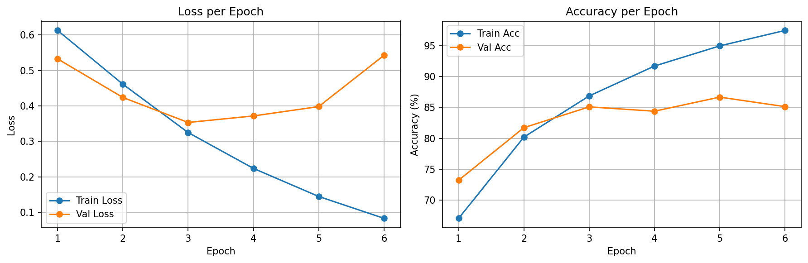
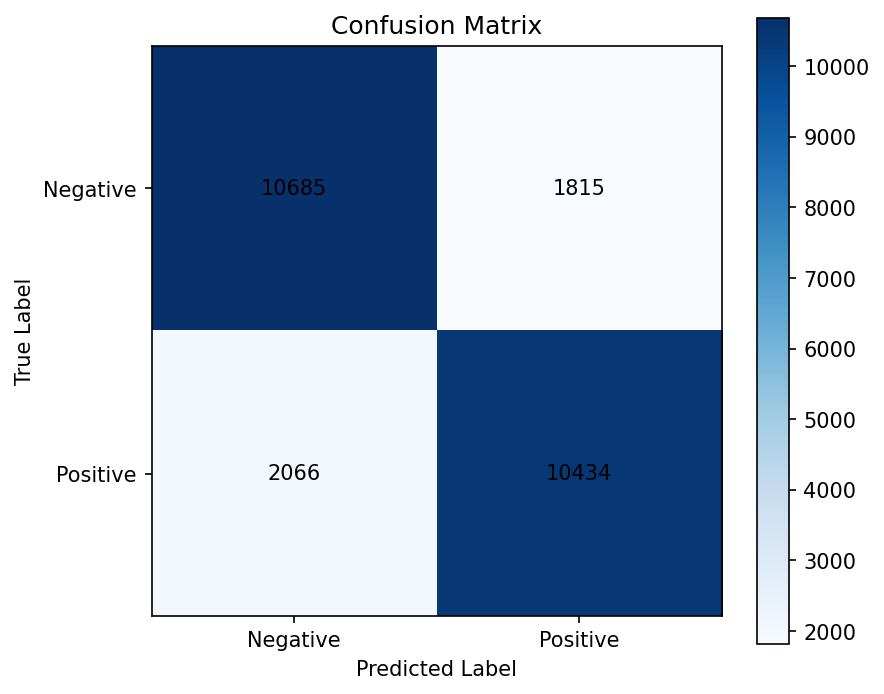

# 5. LSTM Sentiment Analysis — IMDB Review Classification

Binary sentiment classification on **IMDB movie reviews** using a **single-layer LSTM**.

This project is the next step after the vanilla RNN Shakespeare project: instead of predicting the next character, the model now reads an entire review and predicts a single label: **positive** or **negative**.

The project now has three versions:

- **v1**: learned embeddings from scratch
- **v2**: pretrained **GloVe** initialization with trainable embeddings
- **v3**: pretrained **GloVe** initialization with frozen embeddings

---

## Why LSTM?

### The limitation from the previous project

In the Shakespeare project, the vanilla RNN could learn short-range patterns such as spelling, punctuation, and formatting, but it struggled to preserve meaning across longer sequences. A single hidden state was doing all the work, and gradients faded as sequence length grew.

Movie reviews make this limitation even more obvious:

- sentiment is often expressed over many words, not a single token
- phrases like `not good`, `surprisingly decent`, or `slow at first but worth it` depend on order and context
- the model needs to compress an entire review into one useful summary vector

### What LSTM changes

LSTM adds a **cell state** and **gates** that control what to remember, update, or forget. That gives it a much better chance of keeping important context alive across long sequences.

This project also introduces **word embeddings**, so words are no longer represented as huge sparse one-hot vectors. Instead, each token gets a learned dense vector that the model can organize semantically during training.

---

## Dataset

**Source:** IMDB via Hugging Face `datasets`

| Split | Size | Notes |
|------|------|------|
| Train | 20,000 | from the original 25k training set |
| Validation | 5,000 | stratified split, `seed=42` |
| Test | 25,000 | untouched until final evaluation |

### Preprocessing

- Tokenization: simple whitespace split
- Vocabulary: top **25,000** words from the training split only
- Special tokens:
  - `<pad> = 0`
  - `<unk> = 1`
- Max length: **256** tokens
- Labels:
  - `0 = negative`
  - `1 = positive`

This is intentionally simple and educational. The point of v1 was to understand sequence modeling, padding, embeddings, and LSTM training before moving on to pretrained embeddings in v2 and a frozen-vs-trainable comparison in v3.

---

## Architecture

```text
Input (N, seq_len_in_batch)              # word indices
  -> nn.Embedding(vocab_size, 100)       # (N, seq_len_in_batch, 100)
  -> pack_padded_sequence(...)           # remove padded tail for LSTM
  -> nn.LSTM(100, 256, batch_first=True) # final hidden state: (1, N, 256)
  -> h_n[-1]                             # (N, 256)
  -> nn.Linear(256, 1)                   # (N, 1) binary logit
```

| Component | Spec |
|----------|------|
| Embedding | `nn.Embedding(vocab_size, 100, padding_idx=0)` in v1, `nn.Embedding.from_pretrained(...)` in v2/v3 |
| LSTM | `nn.LSTM(100, 256, num_layers=1, batch_first=True)` |
| Classifier | `nn.Linear(256, 1)` |
| Loss | `BCEWithLogitsLoss` |
| Optimizer | `Adam(lr=0.001)` |
| Gradient clipping | `max_norm=1.0` |
| Early stopping | validation loss, `patience=3` |
| Max epochs | `15` |
| Total params | `2,867,049` |

---

## Important Implementation Decisions

### 1. Why output shape is `(N, 1)`

This is a **binary classification** task, not next-token prediction. Each review needs only one output logit, so the final layer is:

```python
nn.Linear(256, 1)
```

That is why training uses:

- `BCEWithLogitsLoss`
- `sigmoid(logits) > 0.5` for prediction

rather than `CrossEntropyLoss + argmax`.

### 2. Why packed sequence mattered

The first naive version simply took the final hidden state after feeding padded reviews through the LSTM. That turned out to be a serious mistake.

Short reviews were read like this:

```text
real words ... <pad> <pad> <pad> <pad> ...
```

So the model summary was being taken **after many meaningless padding steps**, not right after the final real word. That hurt representation quality badly.

Two fixes were tried:

| Step | Idea | Outcome |
|------|------|---------|
| Naive padded LSTM | use final hidden state after full padded sequence | ~51% test acc |
| Packed sequence | make the LSTM ignore padding timesteps | ~81% test acc |
| Dynamic batch trimming | trim each batch to its own longest review before packing | kept accuracy stable, reduced wasted computation |

This became one of the main lessons of the project:

> In sequence models, padding is not just a data-formatting detail. It can directly affect the quality of the final representation if handled incorrectly.

### 3. Why dynamic padding was added

All reviews were still stored with a global maximum length of 256 for simplicity. But many batches did not need all 256 steps.

So a custom `collate_fn` trims each batch to its own maximum real length before the embedding/LSTM step. This keeps the pipeline simple while reducing wasted work.

### 4. Why v2 moved to GloVe

v1 proved that the LSTM classifier itself worked, but the embedding layer still had to learn word meaning from scratch.

That made the next step very natural:

- keep the same LSTM classifier
- keep the same train/val/test split and training hyperparameters
- change only the embedding initialization

That is the text analogue of Project 3's transfer learning story. Instead of importing image features from a pretrained ResNet, v2 imports **word-level semantic structure** from pretrained GloVe vectors.

### 5. Why v3 froze GloVe

v2 improved the baseline, but it still mixed two effects together:

- the value of starting from pretrained word vectors
- the value of fine-tuning those vectors for IMDB sentiment

So v3 keeps the same GloVe initialization but freezes the embedding layer.

That turns v3 into a clean ablation:

> How much of the gain comes from pretrained semantic priors alone, and how much comes from adapting them to the task?

---

## Version Progression

| Version | Main Change | Best Val Loss | Best Val Acc | Final Test Loss | Final Test Acc | Notes |
|-------|-------|-------|-------|-------|-------|-------|
| **v1** | learned embeddings from scratch | 0.4376 | 83.08% | 0.4587 | 81.91% | packed sequence + dynamic padding baseline |
| **v2_glove** | initialize embeddings from GloVe (63.25% vocab coverage) | 0.3533 | 86.68% | 0.3692 | 84.48% | +2.57%p over v1 |
| **v3_glove_frozen** | same GloVe initialization, but freeze the embedding layer | 0.3603 | 84.96% | 0.3680 | 83.62% | +1.71%p over v1, but below v2 |

### What v1 taught

v1 established the core baseline:

- the packed LSTM setup was valid
- padding handling mattered enormously
- the model could already reach solid performance with simple tokenization and scratch embeddings

But it also revealed a limitation:

> the embedding layer was spending part of its capacity just learning basic word meaning from scratch

That led directly to v2.

### Why that led to v2

v2 asked a very focused question:

> If we keep the LSTM classifier and training policy fixed, how much does a better starting word representation help?

The answer was meaningful:

- GloVe matched **15,814 / 25,002** vocabulary items (**63.25%**)
- test accuracy improved from **81.91%** to **84.48%**
- the model started stronger in the very first epochs and generalized better overall

### What v2 taught

v2 established that pretrained embeddings really mattered:

- even with the same LSTM classifier, training became stronger much earlier
- the model reduced the false-positive bias seen in v1
- the gain was large enough to be clearly meaningful, not just noise

But one question still remained:

> Was the improvement coming mostly from pretrained semantics, or from fine-tuning those semantics for IMDB?

That led directly to v3.

### Why that led to v3

v3 changed only one thing relative to v2:

- `freeze_embeddings=False` in v2
- `freeze_embeddings=True` in v3

This made the final comparison very clean:

- **v3 frozen** still beat v1, so pretrained vectors help even without adaptation
- **v2 trainable** stayed best, so task-specific fine-tuning adds another real gain

---

## Results

### Current Best Result (v2: GloVe + trainable)

| Metric | Value |
|-------|-------|
| GloVe Coverage | **15,814 / 25,002 words (63.25%)** |
| Best Val Loss | **0.3533** |
| Best Val Accuracy | **86.68%** |
| Final Test Loss | **0.3692** |
| Final Test Accuracy | **84.48%** |
| Early Stopping | epoch 6 |

This is a meaningful step up from the v1 baseline while keeping the rest of the architecture and training setup fixed.

### Frozen vs Trainable GloVe

| Version | Embedding Policy | Best Val Acc | Test Acc | Interpretation |
|-------|-------|-------|-------|-------|
| **v2_glove** | pretrained + trainable | 86.68% | 84.48% | best overall result |
| **v3_glove_frozen** | pretrained + frozen | 84.96% | 83.62% | still better than v1, but worse than v2 |

This is the clearest final conclusion of Project 5:

- pretrained embeddings help on their own
- but allowing those embeddings to adapt to the sentiment task works better than freezing them

### Training Curves



The v2 curves show two useful things:

- pretrained embeddings help the model start stronger much earlier
- overfitting still appears after the best checkpoint, so GloVe improves representation quality but does not remove the need for early stopping

So the improvement is real, but it is not magic. Better word vectors help, while sequence-level generalization remains the main challenge.

---

## Confusion Matrix Analysis



The v2 confusion matrix was:

```text
[[10685, 1815],
 [2066, 10434]]
```

This means:

- **True Negative:** 10,685
- **False Positive:** 1,815
- **False Negative:** 2,066
- **True Positive:** 10,434

### What this tells us

- Compared with v1, **false positives dropped sharply** (`2512 -> 1815`)
- False negatives rose only slightly (`2010 -> 2066`)
- Negative specificity improved to about **85.5%**
- Positive recall remains about **83.5%**

So v2 is less easily fooled by local positive words inside negative reviews. The classifier becomes more balanced, and the overall gain comes mostly from reducing false positives.

That pattern also appears in the qualitative error analysis below.

For comparison, the frozen v3 model produced:

```text
[[10793, 1707],
 [ 2387, 10113]]
```

That is a useful tradeoff to notice:

- false positives dropped a bit further (`1815 -> 1707`)
- false negatives rose more noticeably (`2066 -> 2387`)

So freezing GloVe made the classifier a bit more conservative. It became less eager to predict positive, but that extra caution cost too many missed positives, which is why v3 finished below v2 overall.

---

## Wrong Prediction Analysis

See the full text reports here:

- [v2 Wrong Prediction Report](results/v2_glove/wrong_predictions.md)
- [v3 Wrong Prediction Report](results/v3_glove_frozen/wrong_predictions.md)

The qualitative errors changed in a useful way from v1 to v2.

### Common false positive pattern in v2

False positives still exist, but they now look more specific:

- `enjoy`
- `best`
- `decent`
- `enjoy`
- franchise/action praise language

These reviews often sound enthusiastic locally, especially in genre-heavy action or martial-arts discussions, even when the overall judgment is negative.

### Common false negative pattern in v2

False negatives more often come from reviews whose wording is formal, socially serious, or thematically heavy:

- `controversial`
- `lack`
- `abuse`
- `hypocrisy`

In those cases, the model sometimes follows the emotional tone of the vocabulary more than the final positive evaluation.

### Takeaway

GloVe helped the model understand word meaning better, but it still struggles with:

- mixed sentiment
- contrastive phrasing
- reviews where topic vocabulary and final sentiment do not align cleanly

The v3 report adds one more lesson:

- frozen embeddings are still useful
- but they miss more subtle positive reviews than the trainable v2 model

---

## What Changed vs Project 4?

| Project 4: RNN Shakespeare | Project 5: LSTM Sentiment |
|---------------------------|---------------------------|
| character-level modeling | word-level modeling |
| next-character prediction | whole-sequence classification |
| one-hot encoding | learned embeddings |
| `CrossEntropyLoss` + `argmax` | `BCEWithLogitsLoss` + sigmoid threshold |
| perplexity | accuracy / confusion matrix |
| vanilla RNN hidden state | LSTM hidden state + cell state |

The shift is not just from one architecture to another. It is also a shift from **sequence generation** to **sequence understanding**.

---

## Lessons Learned

**Padding can quietly break sequence classification.**  
The first implementation looked reasonable but produced almost random performance because the final hidden state was taken after long padding tails. Packed sequences fixed the real problem.

**A fair comparison is worth preserving.**  
v2 and v3 kept the split, optimizer, learning rate, patience, epoch ceiling, and LSTM architecture fixed. That makes the embedding comparison much easier to interpret honestly.

**Pretrained embeddings gave a real head start.**  
GloVe covered 63.25% of the vocabulary. Both pretrained versions beat the scratch baseline, and the trainable version produced the best overall result.

**Frozen pretrained features help, but task adaptation helps more.**  
v3 still improved over v1, which shows that pretrained semantics matter on their own. But v2 stayed ahead, which shows that adapting those vectors to the sentiment task adds another meaningful gain.

**The right metric depends on the task.**  
Perplexity was meaningful for next-character prediction. For IMDB sentiment, the right tools are loss, accuracy, confusion matrix, and qualitative error analysis.

**Embeddings are the natural next step after one-hot.**  
Character one-hot vectors were acceptable in the Shakespeare project because the vocabulary was only 65 symbols. For words, one-hot would be huge and inefficient, so `nn.Embedding` becomes the right abstraction.

**Simple preprocessing is enough to learn real NLP lessons.**  
This project uses whitespace tokenization and a fixed top-25k vocabulary, but it still exposes the important ideas: vocab building, unknown tokens, padding, variable-length batches, and sequence summarization.

**Error analysis matters more than a single accuracy number.**  
v1 showed a clear false-positive bias. v2 reduced that bias, but the wrong-prediction report still shows failure cases around mixed sentiment, formal tone, and socially heavy wording.

---

## Closing Project 5

Project 5 now has a clean three-step story:

- **v1** taught that padding correctness was essential
- **v2** showed that pretrained word representations improved generalization
- **v3** showed that frozen embeddings still help, but trainable GloVe works best

That makes this a good stopping point for the LSTM project from a portfolio perspective. The next strong question is no longer inside LSTM itself. It is:

> what architecture should replace recurrence as the next major sequence-modeling step?

That leads naturally to the next project: **Transformer from scratch**.

## How to Run

```bash
# From the 5_LSTM_Sentiment/ directory (v1 baseline)
python scripts/train.py

# Resume v1
python scripts/train.py --resume-from results/v1/best_model.pth

# Run v2 with pretrained GloVe embeddings
python scripts/train_v2_glove.py

# Resume v2
python scripts/train_v2_glove.py --resume-from results/v2_glove/best_model.pth

# Run v3 with frozen GloVe embeddings
python scripts/train_v3_glove_frozen.py

# Resume v3
python scripts/train_v3_glove_frozen.py --resume-from results/v3_glove_frozen/best_model.pth
```

Artifacts are saved to version-specific folders:

- `results/v1/`
- `results/v2_glove/`
- `results/v3_glove_frozen/`
